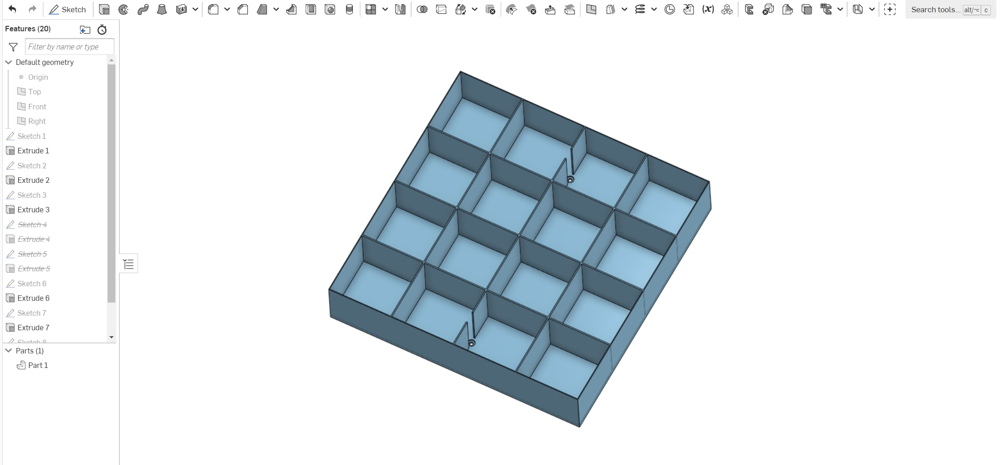
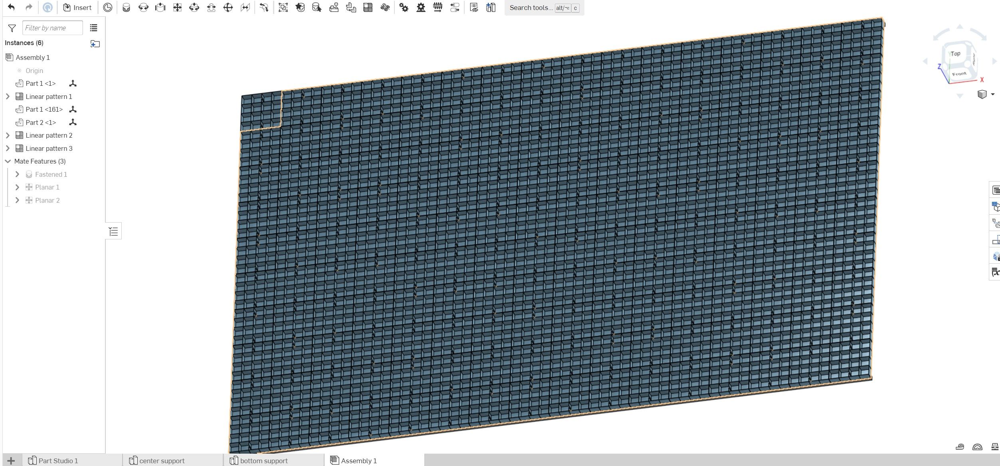

# Rubik-Cube
automatic Rubik's Cube solve robot, hardware and software

### I want to make a Rubik's cube Mosaics art
like this one

But I want it bigger, my project involves using 2560 cubes arranged in a 64x40 grid. Each cube can be individually removed or changed, supported by a specially designed system.

However, a significant challenge arose in manipulating each cube to achieve a specific configuration. Initially, I tried using the Beginner's method of cube solving, but quickly realized that manually adjusting each cube to a desired state was impractical—it could take weeks or even months. Unlike most cube-solving robots, which are designed to reset a cube to its original state, my project requires a robot capable of arranging cubes into any specified configuration.

After some research, I found that there wasn't a ready-made solution for this unique requirement. This realization led me to not only design and build the robot but also develop the necessary algorithm. I discovered a hardware solution at RCR3D(https://www.rcr3d.com/index.html), which offers 3D printable frames that, combined with several servo motors and screws, allow for the construction of a functional cube robot.

For the algorithm, after evaluating different methods, I opted to use the A\* algorithm to determine the quickest solution. The entire code, including this algorithm, is encapsulated in a 'solver.py' file. I plan to enhance this file with detailed comments to aid in understanding and modifying the program.

## Video shows from an initial state to a given state

## Video shows from above given state back to initial state

